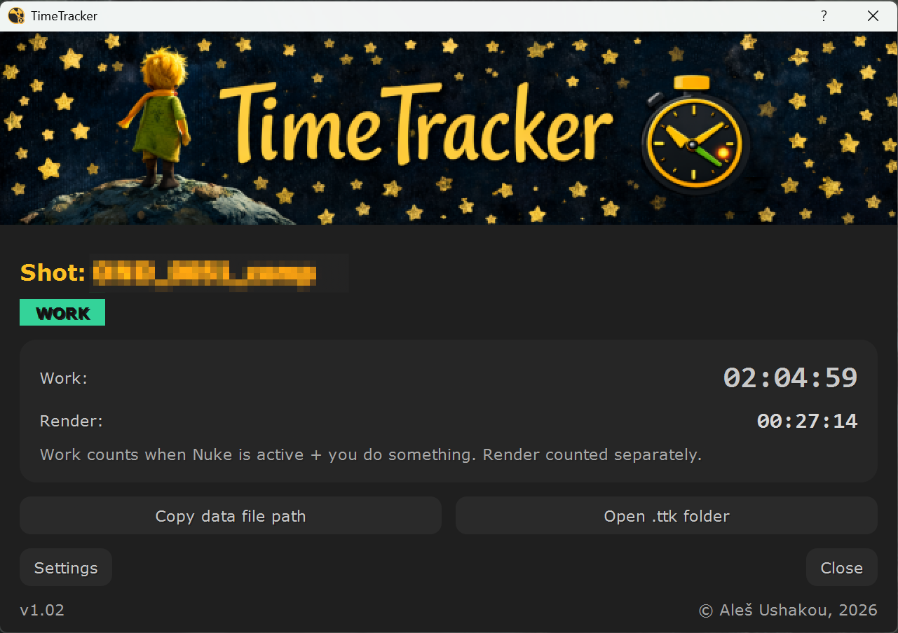
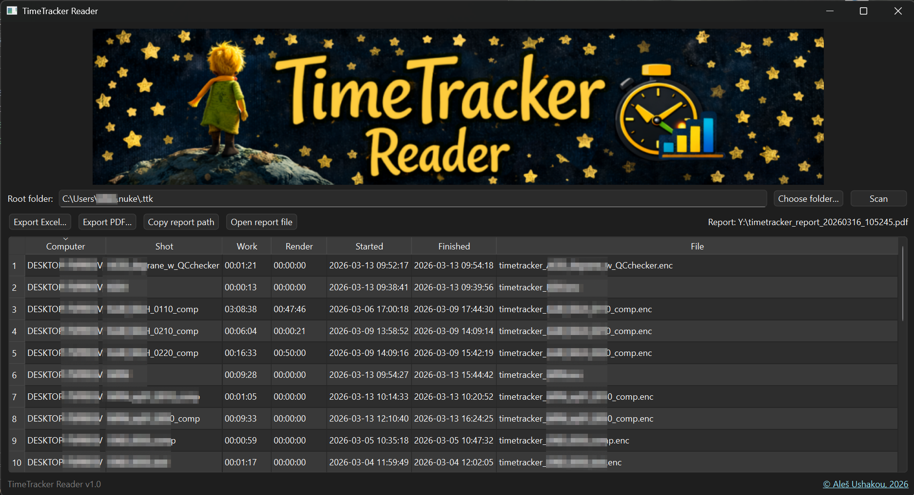

<h1 align="center"> ⏱ TimeTracker for Nuke </h1>

<p>

</p>

A lightweight, encrypted time tracking tool for **The Foundry Nuke**.

Automatically track **work time** and **render time** per shot.

### Features

-   🎬 Per-shot tracking (version-aware: `SH010_v001` → `SH010`)
-   🧠 Smart activity detection (active / idle)
-   🎥 Separate render timer
-   📌 Optional Always-On-Top mode
-   🔐 Stores the result in an encrypted file (for example, when sending reports to clients).


## 🖥 Main Window

<p align="center">

</p>

------------------------------------------------------------------------


## 🚀 Installation

1.  Copy the `TimeTracker` folder into your Nuke directory:

```
    ~/.nuke
```
2.  Add to your `init.py`:

``` python
nuke.pluginAddPath('./TimeTracker')
```

3.  Restart Nuke.
4.  Go to TimeTracker - Show Window

------------------------------------------------------------------------

## 📁 Data Storage

All encrypted tracking data is stored in (the path can be changed in TimeTracker settings):

    ~/.nuke/.ttk/

Each shot gets its own file:

    timetracker_SH010.enc

------------------------------------------------------------------------

## 🔐 Security

Data is stored as encrypted JSON using:

-   PBKDF2-HMAC-SHA256
-   XOR stream encryption
-   Base64 encoding

This prevents casual inspection of tracked time data.

------------------------------------------------------------------------

## 🛠 Render Handling

TimeTracker correctly handles:

-   Render start
-   Render completion
-   Render cancellation
-   Nuke closing during render

Render timer never gets stuck.

------------------------------------------------------------------------

## ⚙ Settings

-   Choose `.ttk` folder
-   Enable Always-On-Top mode

------------------------------------------------------------------------

## 📌 Version

v1.02

------------------------------------------------------------------------

## 📊 TimeTracker Reader
Standalone utility for reading encrypted tracking files.


<p align="center">

</p>


### Reader Features

-   Scan `.ttk` folders
-   View all tracked shots
-   Sort by work / render time
-   Export reports to **Excel (.xlsx)** or **PDF**
-   Copy report path
-   Open exported report directly
-   No Nuke required

### Reader Requirements

The standalone reader requires:

```
pip install openpyxl reportlab
```


## 🖥 Main Window
<p align="center">

</p>

------------------------------------------------------------------------

### ❤️ Evolution

<a href="https://star-history.com/#AlesUshakou/TimeTrackerForNuke&Date">
  <picture width=640>
    <source media="(prefers-color-scheme: dark)" srcset="https://api.star-history.com/svg?repos=AlesUshakou/TimeTrackerForNuke&type=Date&theme=dark" />
    
  </picture>
</a>

------------------------------------------------------------------------

## 👤 Author

© Aleš Ushakou
📎 [LinkedIn](https://www.linkedin.com/in/ales-ushakou/)  

------------------------------------------------------------------------


## 📜 License

MIT License

Copyright (c) 2026 Aleš Ushakou

